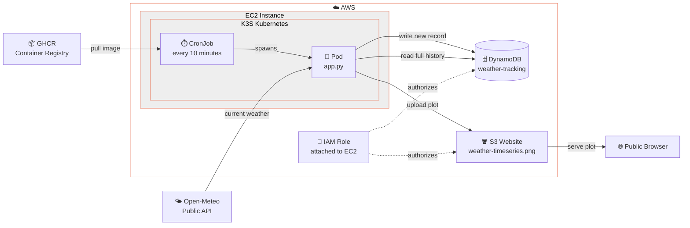

# DS5220 Data Project 2

Create, schedule, and run a containerized data pipeline in Kubernetes.

## Overview

In this project you will design, containerize, schedule, and operate a real data pipeline running inside a Kubernetes host on AWS. This repository now contains a weather pipeline that polls the Open-Meteo API every 10 minutes for Charleston, SC, stores the readings in DynamoDB, and publishes an evolving plot to an S3 website.

Your pipeline should run for at least 72 hours, collecting at least 72 data points. Choose a data source that is updated at least hourly.

### Learning Objectives

By the end of this project you will be able to wrangle all the elements of a working container-driven data pipeline:

1. **Provision cloud infrastructure** — launch and configure an EC2 instance, attach an Elastic IP and proper IAM role/policy, and enable S3 static website hosting.
2. **Deploy and operate Kubernetes** — install K3S, inspect cluster state with `kubectl`, and understand namespaces, pods, secrets, and jobs.
3. **Containerize a Python application** — write a Python application, `Dockerfile`, build a container image, and push it to a public container registry (GHCR).
4. **Schedule work with CronJobs** — define a Kubernetes `CronJob` manifest, control its schedule, and retrieve logs from completed job pods.
5. **Manage secrets securely** (optional) — store API keys as Kubernetes Secrets and inject them as environment variables so sensitive values never appear in code or YAML files.
6. **Persist data in DynamoDB** — create a DynamoDB table with a partition key and sort key, write items from a containerized job, and query for the most recent entry.
7. **Consume a REST API programmatically** — parse JSON responses and handle incremental data collection across repeated runs.
8. **Generate and publish data visualizations** — produce an evolving time-series plot with `seaborn`, overwrite it on each pipeline run, and serve it via S3 website hosting.

---

## Setup

### 1. S3 Bucket

Create a new bucket for this project, enable it as a website, and make all files within it publicly readable. Follow Steps 1 and 2 in [this AWS documentation](https://docs.aws.amazon.com/AmazonS3/latest/userguide/WebsiteAccessPermissionsReqd.html). The bucket website settings will give you a unique `http://` address you will use as your deliverable URL.

### 2. EC2 Instance

Create a `t3.large` Ubuntu 24.04 LTS instance with a 30GB boot volume. Attach an Elastic IP so your host address stays consistent. Attach a Security Group that allows inbound access on ports 22, 80, 8000, and 8080. Give the instance an IAM Role with:
- **S3**: `PutObject`, `GetObject` on your website bucket
- **DynamoDB**: `PutItem`, `GetItem`, `Query` on your tracking table named `weather-tracking`.

### 3. Install K3S

Either by hand or via bootstrapping, install K3S — a lightweight Kubernetes distribution:

```bash
curl -sfL https://get.k3s.io | sh -s - --write-kubeconfig-mode 644
```

If you run this during instance bootstrapping, the `root` user will have cluster access. Run it interactively as `ubuntu` and that user will have access instead. Access is confirmed by the presence of `~/.kube/config`.

### 4. Check the Status of Kubernetes

Run these commands to verify your cluster is up and healthy:

```bash
kubectl cluster-info
kubectl get namespaces
kubectl get pods -A
kubectl get nodes
```

### 5. Run a Simple Scheduled Job

Apply the provided `simple-job.yaml` to confirm scheduling works end-to-end:

```bash
kubectl apply -f simple-job.yaml
```

Wait a few minutes (the job fires every 5 minutes), then check for completed pods:

```bash
kubectl get pods
```

```
NAME                           READY   STATUS      RESTARTS   AGE
hello-cronjob-29582745-qdzc9   0/1     Completed   0          5m37s
hello-cronjob-29582750-f2l9t   0/1     Completed   0          37s
```

Read the output of a completed pod:

```bash
kubectl logs hello-cronjob-29582750-f2l9t
# Hello from CronJob - Tue Mar 31 13:50:01 UTC 2026
```

Once confirmed, remove the test job:

```bash
kubectl delete -f simple-job.yaml
```

> **Why are we running our own Kubernetes cluster?**
> Yes it is wasteful to spin up a dedicated EC2 instance for a single scheduled job — but your laptop isn't running 24/7, and I want you to experience Kubernetes from the admin side: provisioning it yourself, using `kubectl` directly, and seeing pods, jobs, secrets, and persistent storage all working together in a "real" cluster. Getting you this visibility into other existing K8S clusters is difficult.

---

## Sample Data Application — Charleston Weather Tracker

The application in the `iss-reboost/` directory now fetches current weather conditions for Charleston, South Carolina from the Open-Meteo API every 10 minutes. Each run stores a timestamped weather snapshot in DynamoDB, reads the full history back out, and regenerates a plot showing how the temperature gap and wind speed change over time.



On each run this application performs the following tasks:

1. Calls the [Open-Meteo forecast API](https://open-meteo.com/en/docs) for Charleston weather data with Fahrenheit temperatures.
2. Extracts the current `temperature_2m`, `apparent_temperature`, `wind_speed_10m`, and `precipitation` fields.
3. Computes `temp_gap_f = temperature_2m - apparent_temperature`.
4. Writes the full record to DynamoDB.
5. Reads the full history from DynamoDB, renders a plot of temperature gap and wind speed over time, and uploads it to S3.

### Create the DynamoDB Table

Before deploying the job, create the table from the AWS CLI on your EC2 instance or local machine:

```bash
aws dynamodb create-table \
  --table-name weather-tracking \
  --attribute-definitions \
    AttributeName=source_id,AttributeType=S \
    AttributeName=timestamp,AttributeType=S \
  --key-schema \
    AttributeName=source_id,KeyType=HASH \
    AttributeName=timestamp,KeyType=RANGE \
  --billing-mode PAY_PER_REQUEST \
  --region us-east-1
```

The **partition key** is `source_id` (for example `"charleston-weather"`) and the **sort key** is `timestamp` (ISO 8601 UTC string). The sort key keeps all records in chronological order and makes it trivial to retrieve the full time series or newest record with a single `Query`.

### Build and Push the Container

A published image already exists (see the YAML file) but if you want to build and push it yourself, see below. Remember `arm64` vs. `amd64` architecture (Mac users), so you may need to use a GitHub Action for builds (See Lab 6).

```bash
cd iss-reboost/
docker login ghcr.io        # GitHub username + Personal Access Token
docker build -t ghcr.io/skunitzlevy/weather-tracker:latest .
docker push ghcr.io/skunitzlevy/weather-tracker:latest
```

Under **Packages** in your GitHub profile, find the image and set its visibility to **Public** so Kubernetes can pull it.

### Deploy the Weather CronJob

Edit `iss-job.yaml` and set `S3_BUCKET` to your website bucket name, such as `ds5220-weather`, then apply it:

```bash
kubectl apply -f iss-job.yaml
```

The job fires every 10 minutes. Monitor it:

```bash
kubectl get cronjobs
kubectl get pods
kubectl logs <pod-name>
```

A healthy log line looks like:

```
WEATHER | temp=67.8 F | feels_like=63.2 F | gap=4.6 F | wind=15.4 km/h | precip=0.0 mm
```

Query your data directly from the CLI to verify accumulation:

```bash
aws dynamodb query \
  --table-name weather-tracking \
  --key-condition-expression "source_id = :id" \
  --expression-attribute-values '{":id": {"S": "charleston-weather"}}' \
  --max-items 5 \
  --region us-east-1
```

---

## Your Data Application

Now build your own data pipeline. It should take a similar form to the ISS sample — a containerized Python script running on a Kubernetes CronJob schedule — but it should ingest and process completely different data. Requirements:

- Collects data at least once per hour for at least 72 hours (≥ 72 data points)
- Persists data across runs (DynamoDB, S3 Parquet/CSV, or similar)
- Generates an evolving plot and publishes it to your S3 website bucket as `plot.png`
- Generates an evolving data file and published it to your S3 website bucket as `data.csv` or `data.parquet`.
- Lives in its own subdirectory with its own `Dockerfile` and `requirements.txt`

### If Your Data Source Requires a Key

Never put API keys in a YAML file or Docker image. Store them as a Kubernetes Secret:

```bash
kubectl create secret generic my-api-secret \
  --from-literal=API_KEY=your_key_here
```

Then reference the secret value as an ENV variable in your CronJob spec:

```yaml
env:
  - name: API_KEY
    valueFrom:
      secretKeyRef:
        name: my-api-secret
        key: API_KEY
  - name: S3_BUCKET
    value: "your-bucket-name"     # plain env var — not a secret
```

Your Python script reads the secret with `os.environ["API_KEY"]`. The key value never appears in any file on disk. Your EC2 IAM role already grants S3 and DynamoDB access, so no AWS credentials are needed anywhere.

### Data Source Ideas

- **Open-Meteo Weather API** — fetch hourly temperature, wind speed, precipitation, or cloud cover for any lat/lon without an API key. [https://open-meteo.com/en/docs](https://open-meteo.com/en/docs)
- **USGS Water Services** — stream gauge readings updated every 15 minutes for thousands of rivers and streams across the US. [https://waterservices.usgs.gov/rest/IV-Service.html](https://waterservices.usgs.gov/rest/IV-Service.html)
- **OpenAQ Air Quality** — real-time PM2.5, ozone, NO₂, and other pollutant readings from monitoring stations worldwide, updated sub-hourly. [https://docs.openaq.org/](https://docs.openaq.org/)
- **OpenSky Network Flight Data** — live positions, altitudes, and velocities for all ADS-B-tracked aircraft currently in the air. [https://openskynetwork.github.io/opensky-api/](https://openskynetwork.github.io/opensky-api/)
- **NOAA Tides and Currents** — observed and predicted water levels at tide stations around the US coast, updated every 6 minutes. [https://api.tidesandcurrents.noaa.gov/api/prod/](https://api.tidesandcurrents.noaa.gov/api/prod/)
- **CoinGecko Crypto Prices** — free, no-key-required endpoint returning current prices, market cap, and 24-hour volume for any cryptocurrency. [https://www.coingecko.com/en/api/documentation](https://www.coingecko.com/en/api/documentation)
- **Transport for London (TfL) Unified API** — live crowding levels, arrival predictions, and disruptions across the London Underground and bus network. [https://api.tfl.gov.uk/](https://api.tfl.gov.uk/)

---

## Deliverables

Submit the following in the Canvas assignment:

1. **Your Data Application Plot URL** — the public `http://` URL to your `plot.png` served from your S3 website bucket (e.g., `http://your-bucket-name.s3-website-us-east-1.amazonaws.com/plot.png`). The plot must represent at least 72 hours / 72 entries of data. Paste the URL directly — if the image does not load it will not be graded.

2. **Your Data Application Repo URL** — the public GitHub URL to your pipeline code. The repository must include the Python script, a `Dockerfile`, and a `requirements.txt`.

3. **Canvas Quiz** — answer the short-answer questions posted in Canvas. These will ask you to reflect on what you built, including:
    - Which data source you chose and why.
    - What you observe in the data — any patterns, spikes, or surprises over the 72-hour window.
    - How Kubernetes Secrets differ from plain environment variables and why that distinction matters.
    - How your CronJob pods gain permission to read/write to AWS services without credentials appearing in any file.
    - One thing you would do differently if you were building this pipeline for a real production system.

### Graduate Students

In addition to the above, submit a short written response (one paragraph each) to the following:

1. In the ISS sample application, data is persisted in DynamoDB. If this were a much higher-frequency application (hundreds of writes per minute), what changes would you make to the persistence strategy and why?
2. In the weather tracker, the plot combines temperature gap and wind speed on the same time axis. What tradeoffs does that introduce compared with plotting them separately, and how would you decide which presentation is better?
3. How does each `CronJob` pod get AWS permissions without credentials being passed into the container?
4. Notice the structure of the `weather-tracking` table in DynamoDB. What is the partition key and what is the sort key? Why do these work well in this example, but may not work for other solutions?
